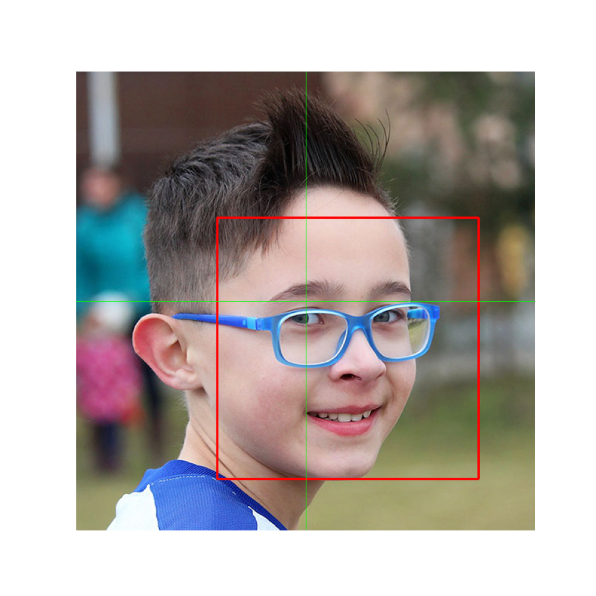
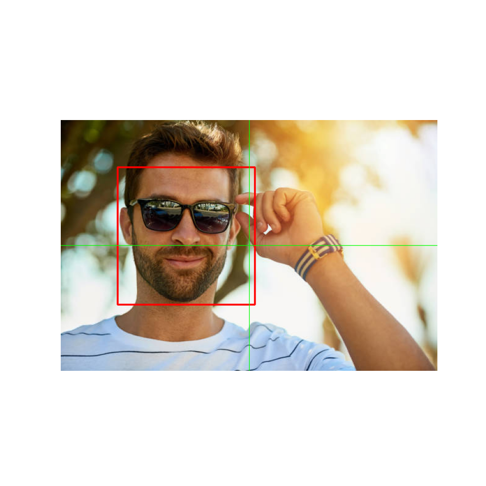
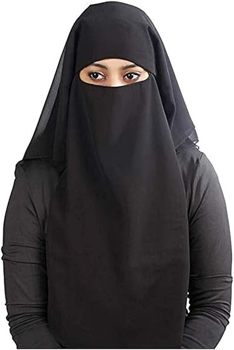

# Examples

### Positive


```
Results
Face Detected: True
Face Area to Image Area Ratio: 0.3241649323621228
Face Height Ratio: 0.5693548387096774
Face Size Requirement: Passed
Horizontal Offset: 0.09032258064516129
Vertical Offset: 0.10161290322580645
Face Centered Requirement: Passed
Wearing Opaque Glasses: No
```

The image passes all checks.

### Negative


```
Results
Face Detected: True
Face Area to Image Area Ratio: 0.1991581763424324
Face Height Ratio: 0.5465686274509803
Face Size Requirement: Failed
Horizontal Offset: 0.16830065359477125
Vertical Offset: 0.0392156862745098
Face Centered Requirement: Passed
Wearing Opaque Glasses: Yes
```

The image fails two checks: The face is not sufficiently centered, and the person is wearing opaque glasses.

### Negative


```
Error: No face detected in image
```

The image fails because the face can not be detected (i.e. the face is not visible).

In `examples/`, you can also find some hints on how to integrate this into a JavaScript app.